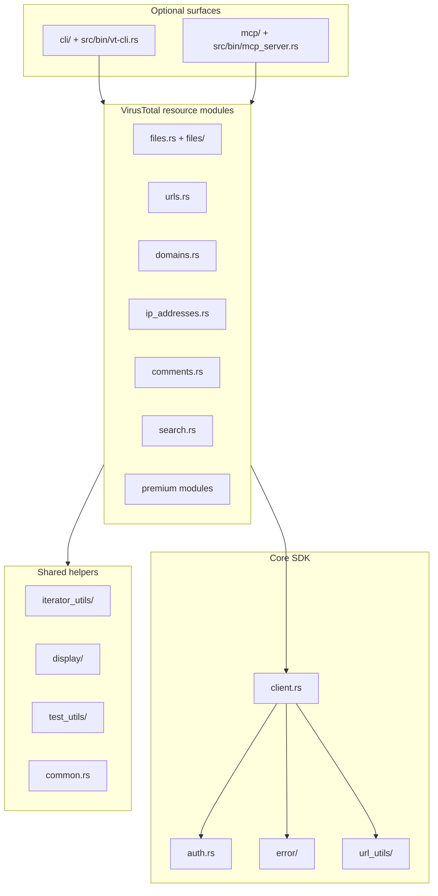

# Architecture

## Overview

`virustotal-rs` is an async Rust SDK for the VirusTotal API v3. The repository ships three related surfaces:

- A reusable library crate covering the public VirusTotal resources and helper utilities
- An optional CLI (`vt-cli`) behind the `cli` feature
- An optional MCP server (`mcp_server`) behind the `mcp`, `mcp-jwt`, and `mcp-oauth` feature flags

## Component Map

## Key Modules

### Core request stack

- `src/client.rs` owns the HTTP client, request execution, and shared configuration.
- `src/auth.rs` and `src/rate_limit.rs` encapsulate API tier handling and throttling.
- `src/error/` maps HTTP and validation failures into a typed error surface.
- `src/url_utils/` centralizes endpoint construction and path/query validation.

### VirusTotal resource clients

The top-level resource modules (`files`, `urls`, `domains`, `ip_addresses`, `comments`, `search`, `collections`, `livehunt`, `retrohunt`, `graphs`, and others) each expose a focused client plus the types required to deserialize that API family.

### Shared developer ergonomics

- `src/iterator_utils/` contains collection iterator adapters and convenience traits.
- `src/display/` provides formatting helpers for CLI and example output.
- `src/test_utils/` provides builders, fixtures, and mock-client helpers used by the test suite.

### Optional CLI and MCP layers

- `src/cli/` and `src/bin/vt-cli.rs` wrap the SDK for command-line usage and indexing workflows.
- `src/mcp/` and `src/bin/mcp_server.rs` expose the SDK through Model Context Protocol transports, including optional JWT and OAuth flows.

## Design Notes

- Feature flags keep operational dependencies out of the default library install.
- The library crate is the source of truth; CLI and MCP layers should stay thin adapters over the reusable client modules.
- The repository keeps a large example set for end-to-end scenarios, but the main correctness signal is the Rust test suite and CI feature-matrix coverage.
